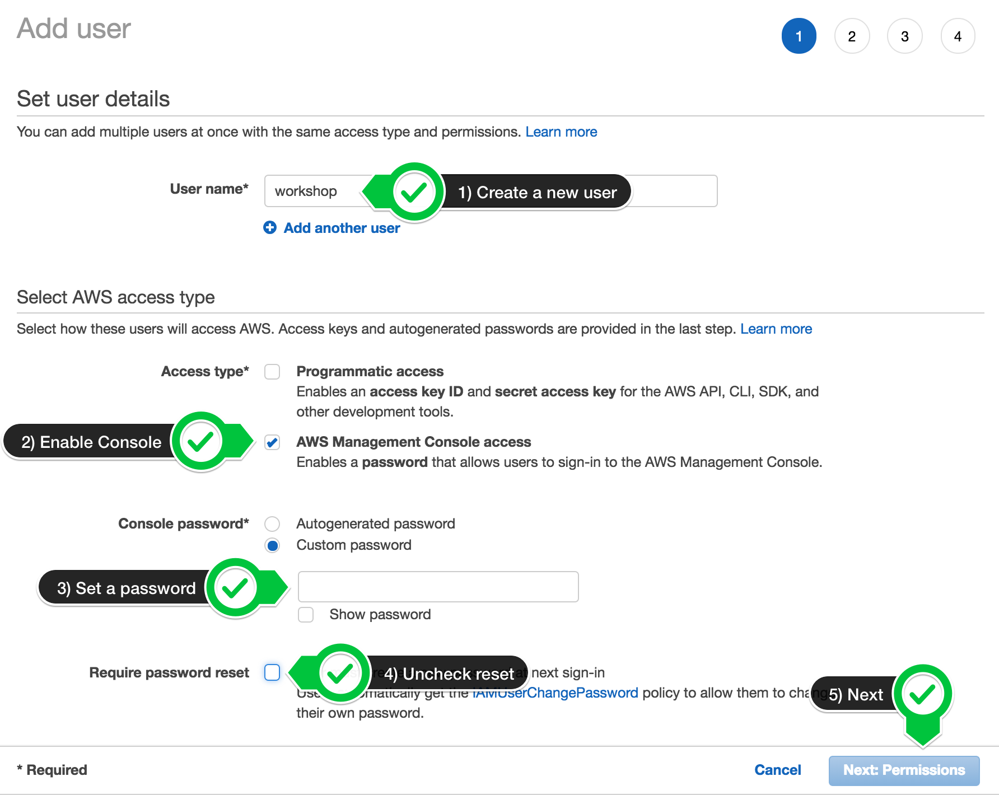
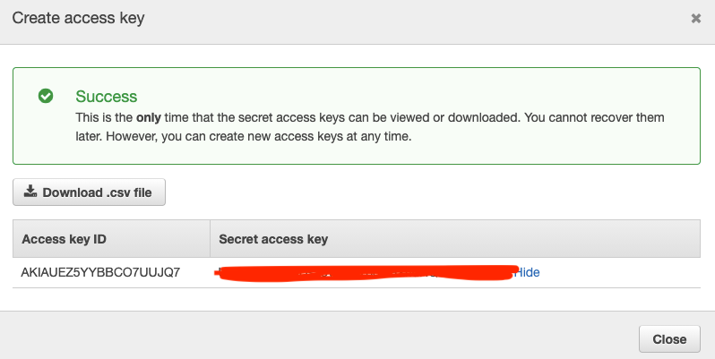

+++
title = "AWS Account"
chapter = false
weight = 2
+++
{}
You are responsible for the cost of the AWS services used while running this workshop in your AWS account.
{}

{}
Your account must have the ability to create new IAM roles and scope other IAM permissions.
{}

## Create an account 

1. If you don't already have an AWS account with Administrator access: [create
one now](http://docs.aws.amazon.com/connect/latest/adminguide/gettingstarted.html#sign-up-for-aws)

2. Once you have an AWS account, ensure you are following the remaining workshop steps
as an **IAM user** with administrator access to the AWS account:
[Create a new IAM user to use for the workshop](https://console.aws.amazon.com/iam/home?region=us-east-1#/users$new)

3. Enter the user details:

Do not close this windows without recording you **AWS_ACCESS_KEY** and **AWS_SECRET_ACCESS**

{}
Please continue to the next section.
{}
