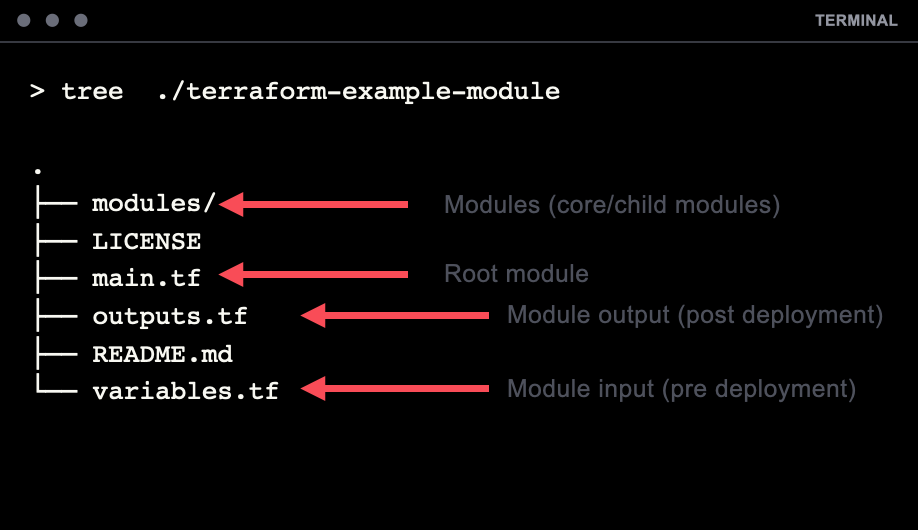

+++
title = "Module Structure"
chapter = true
weight = 2
+++

## Basic Module Structure

- **LICENSE** The license under which this module is available.
- **README.md** The root module and any nested modules should have README files
- **main.tf, variables.tf, outputs.tf**  Primary entrypoint of the module
- **/modules** Nested modules can be loaded under _modules/_

