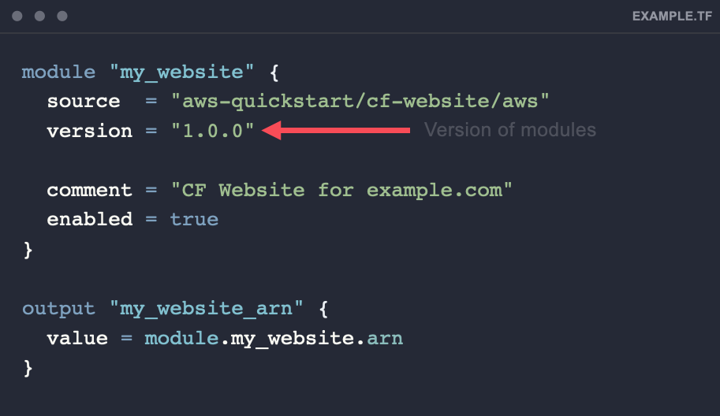

+++
title = "Module Versioning"
chapter = true
weight = 3
+++

## Module Versioning

When using AWS Modules we recommend locking to version while calling the module. This ensures that updates only happen when convenient to you. 

The example below shows how to use versioning.

