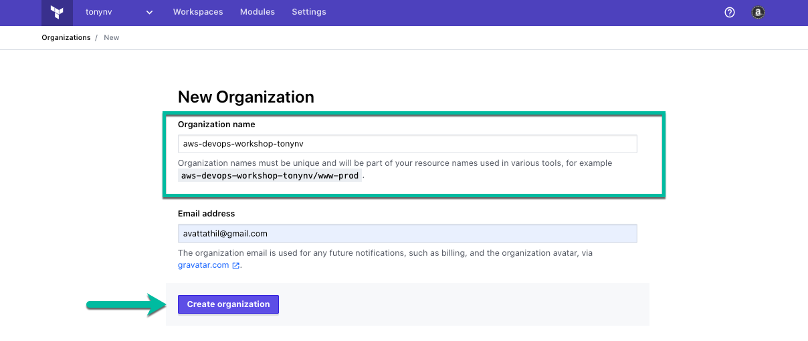

+++
title = "Create an 0rganization"
chapter = true
weight = 11
+++

##Create Terraform organization

- Name your org eg: __aws-devops-workshop-__ with your gitlab userid appended.

Example: aws-devops-workshop-tonynv

- Provide a Email address

- Click Create organization
