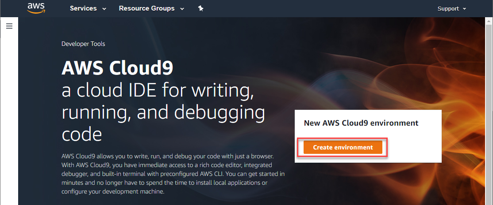
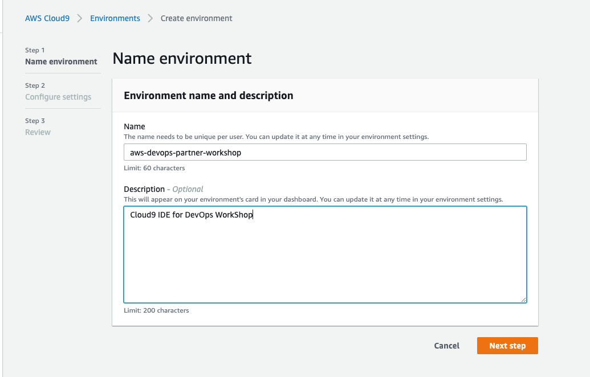
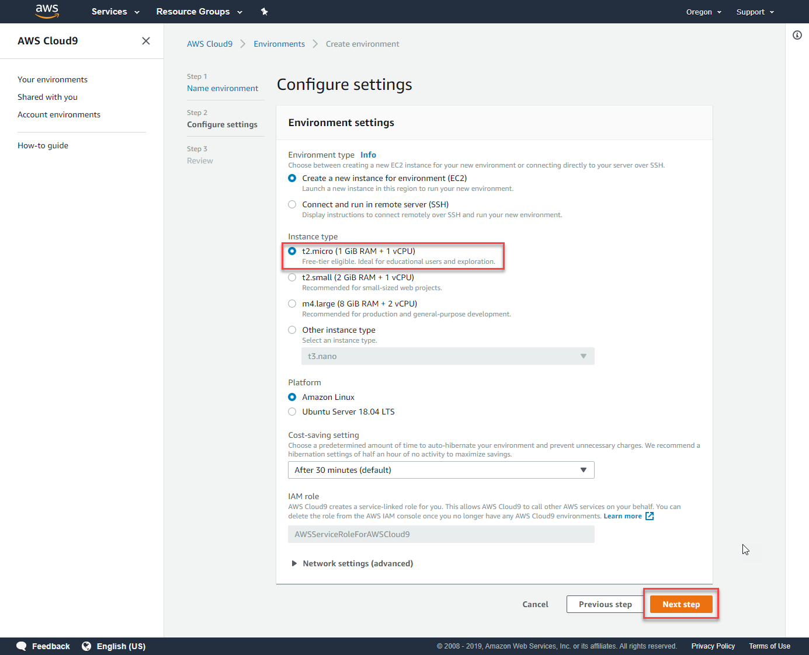
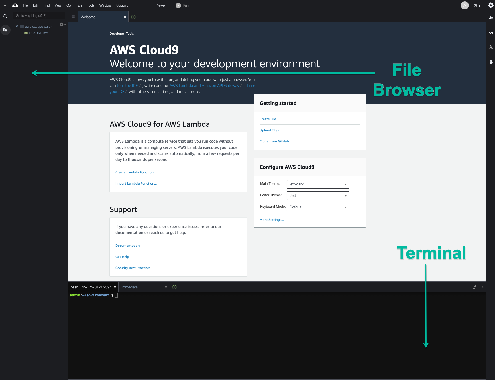
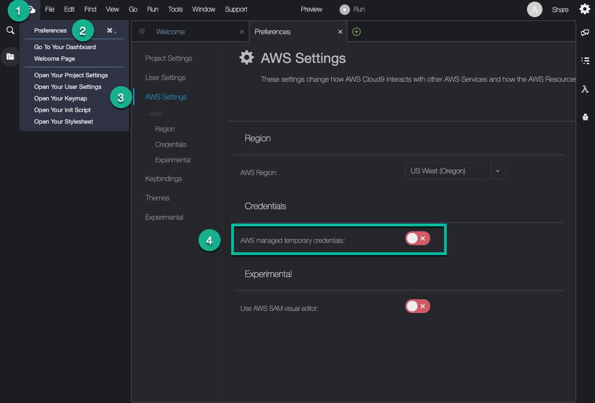

+++
title = "Setup Cloud9"
chapter = true
weight = 40
+++

# Starting AWS Cloud9 IDE

AWS Cloud9 is a cloud-based integrated development environment (IDE) that lets you write, run, and debug your code with just a browser. It includes a code editor, debugger, and terminal. Cloud9 comes pre-packaged with essential tools for popular programming languages and the AWS Command Line Interface (CLI) pre-installed so you don’t need to install files or configure your laptop for this workshop.

{}
Cloud9 works best with Chrome or Firefox, *Not Safari*. This workshop is not supported on a tablet.
{}

From the AWS Management Console, Select **Services > Cloud9** under Developer Tools

Go [Click here for deeplink to Cloud9](https://us-east-1.console.aws.amazon.com/cloud9/home/product)



- Select Create Environment.

- Enter tf-workshop into Name and optionally provide a Description.



Select **Next step**.

## c9 Launch settings:

- Set the Instance type to **t2.micro** (1 GiB RAM + 1 vCPU).

- Leave all other defaults unchanged.




Select **Next step**

Review the environment settings and select Create environment. 

> It will take a couple of minutes for your Cloud9 environment to be provisioned and prepared.

## c9 Environment settings:



- Once ready, your IDE will open to a welcome screen. Below that, you should see a terminal prompt. Close the Welcome tab and drag up the terminal window to give yourself more space to work in.

### Configure AWS credentials for your Cloud9 Workspace

**Click** on the Cloud9 logo in the top left corner

- Choose Preferences



  - In the Preferences tab go to AWS Settings
  - Turn off AWS managed temporary credentials
  - Close the Preferences tab

To ensure temporary credentials aren’t already in place we will also remove any existing credentials file:

```
rm -vf ${HOME}/.aws/credentials
```


