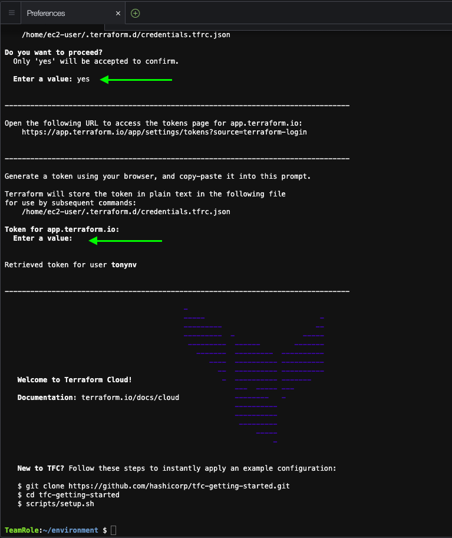

+++
title = "Setup TFC API Token "
chapter = true
weight = 43
+++

### In Cloud9 Terminal

Run `terraform login`

- Confirm by typing **yes**

Paste the following url into your browser to continue `https://app.terraform.io/app/settings/tokens?source=terraform-login`

Click **Create API token** 

Click **to Copy API token to clipboard** 

Paste into you Cloud9 Terminal

Expected output:

