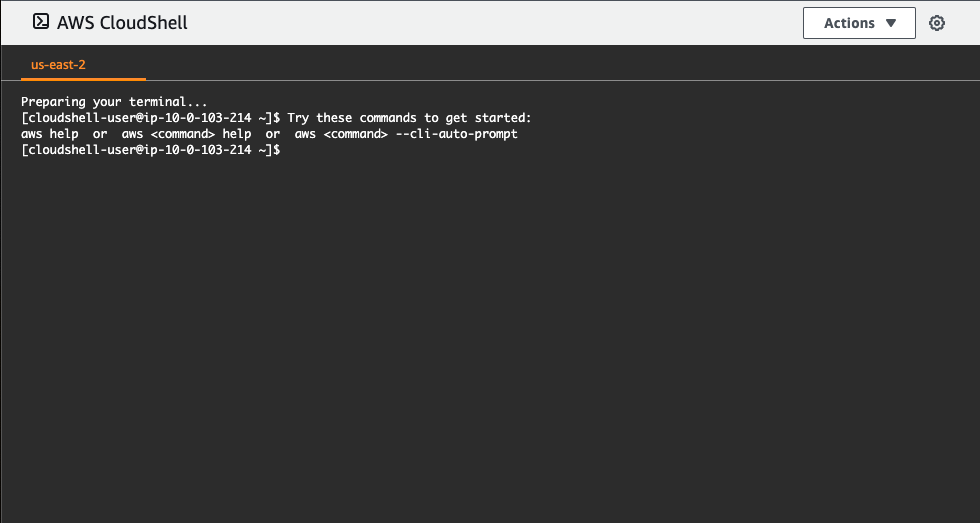

+++
title = "Install terraform in AWS cloud shell"
chapter = true
weight = 40
+++

Go [here](https://us-east-2.console.aws.amazon.com/cloudshell)

## Install terraform

#### Download terraform
`wget https://releases.hashicorp.com/terraform/0.15.1/terraform_0.15.1_linux_amd64.zip`

#### Unzip terraform binaries
`unzip terraform_0.15.1_linux_amd64.zip`

#### Add terraform to path
`sudo mv terraform /usr/local/bin/`

#### Remove zipfile
`rm terraform_0.15.1_linux_amd64.zip`

