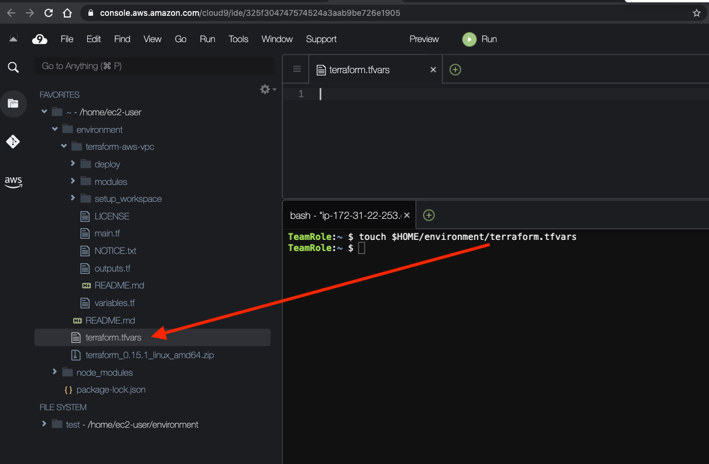
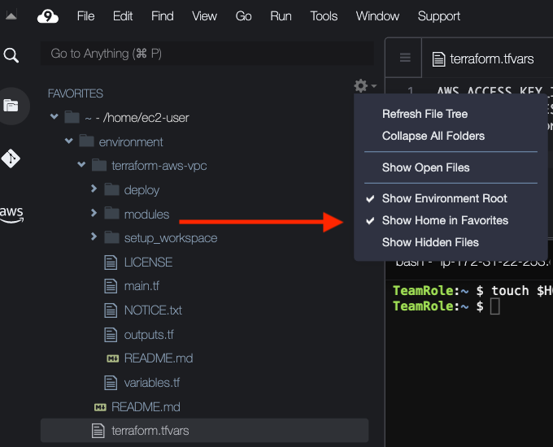
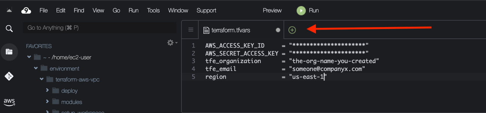

+++
title = "Setup auto tfvars"
chapter = true
weight = 61
+++

#### Configure your tfvars file

`touch $HOME/enviornment/terraform.tfvars`

Create a file that contains the inputs for the vpc module



Open file in cloud9 __(Double click file)__  


Copy:
```
AWS_ACCESS_KEY_ID     = "*********************"
AWS_SECRET_ACCESS_KEY = "*********************"
tfe_organization      = "the-org-name-you-created"
tfe_email             = "someone@companyx.com"
region                = "us-east-1"
```

Paste:



{}
(replace *** with AKEY and SKEY) !!!!CAUTION!!!!: In production this method of input is not recommended
{}% 

