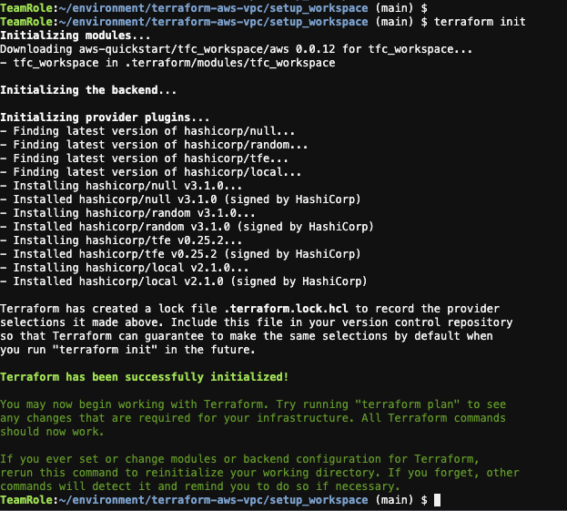
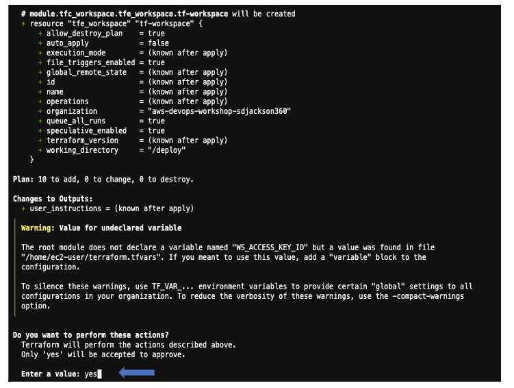
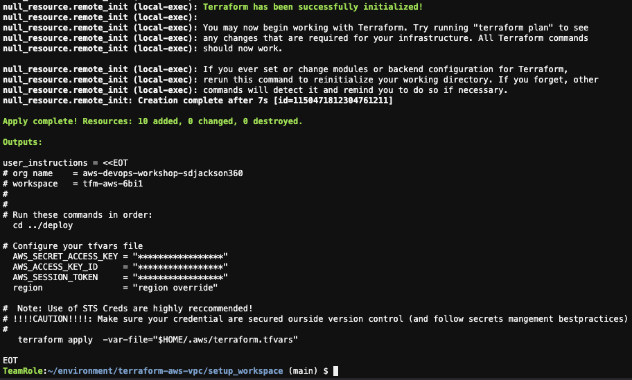
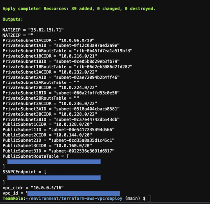

+++
title = "Setup TFC workspace"
chapter = true
weight = 71
+++

#### Export Terraform Config Location

` export TERRAFORM_CONFIG="$HOME/.terraform.d/credentials.tfrc.json"`

#### Setup Terraform workspace
- Change directory to the module root directory.

`cd terraform-aws-vpc/`

- Change to setup_workspace directory

`cd setup_workspace`. 

#### Init terraform 
- Run to following commands in order:

`terraform init`

Expected output:

#### Creating a TFC Workspace
`terraform apply  -var-file="$HOME/environment/terraform.tfvars"`.

Enter **yes** when prompted for input

Expected output:

#### Change to the deploy folder
`cd ../deploy`

#### Deploys into the TFC Workspace 
`terraform apply -auto-approve`

Expected output:

