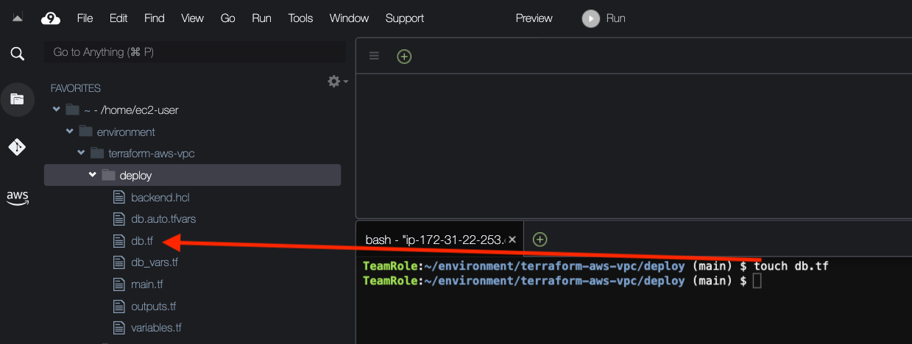
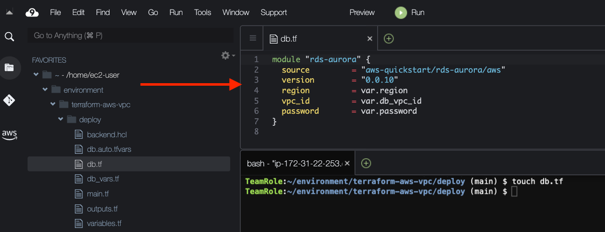
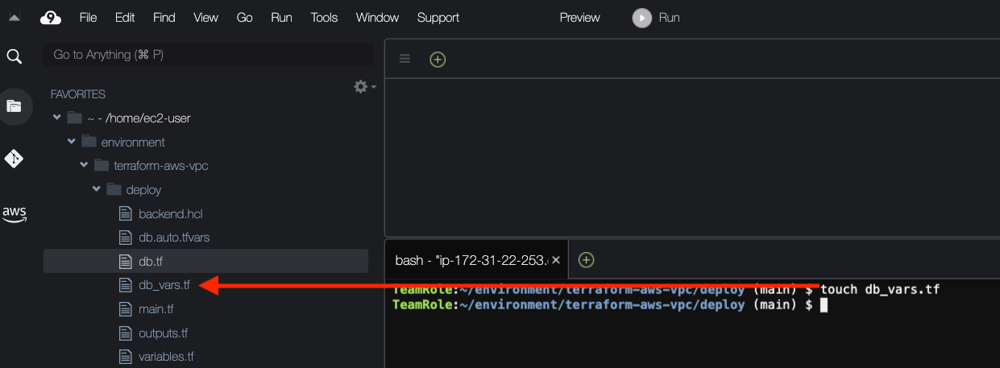
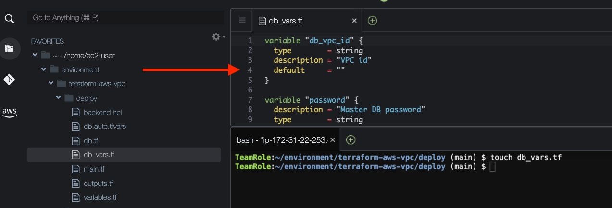

+++
title = "Add dB module"
chapter = true
weight = 81
+++

### Create tfvars files
```
echo "db_vpc_id = $(terraform output vpc_id)" >db.auto.tfvars
echo "password = \"db$(hostid)\"" >>db.auto.tfvars
echo "region = us-east-1" >>db.auto.tfvars
cat db.auto.tfvars
```

#### Create db.tf

`touch db.tf`



Add code snip below into db.tf

Copy:
```
module "rds-aurora" {
  source         = "aws-quickstart/rds-aurora/aws"
  version        = "0.0.10"
  region         = var.region
  vpc_id         = var.db_vpc_id
  password       = var.password
}
```

Paste:



#### Create db_vars.tf

`touch db_vars.tf`

Add code snip below into db_vars.tf


Copy:

```

variable "db_vpc_id" {
  type        = string
  description = "VPC id"
  default     = ""
}

variable "password" {
  description = "Master DB password"
  type        = string
  default     = ""
}
```

Paste:

